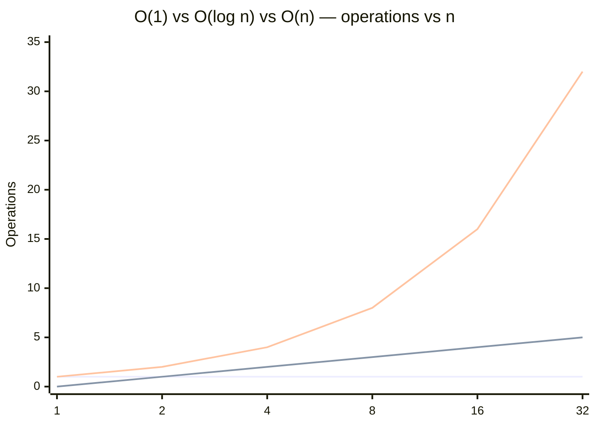

# O(log n) — Logarithmic Time

## 1. Mathematical Definition

`O(log n)` means the operation count grows proportional to the *logarithm* of `n`, not
`n` itself. Concretely, for binary search: every step throws away half the remaining
search space. Starting from `n` items, after 1 step you have `n/2` left, after 2 steps
`n/4`, after `k` steps `n/2^k`. The search ends when there's 1 item left, i.e. when
`n/2^k = 1`, which solves to `k = log₂(n)`.

That's the whole story of why it's "log n" and not something else — the base of the log
(2, 10, e) doesn't matter for Big O purposes, because `log_b(n) = log_2(n) / log_2(b)`,
and that ratio is a constant. So `O(log₂ n)`, `O(log₁₀ n)`, `O(ln n)` are all just
`O(log n)` — see concept.md §1 on dropping constants.

The growth curve itself is the headline fact to internalize: `log n` grows *unbelievably*
slowly. Doubling `n` only adds **one** more step:

| n | log₂(n) (steps) |
|---|---|
| 16 | 4 |
| 1,000 | ~10 |
| 1,000,000 | ~20 |
| 1,000,000,000 | ~30 |
| 1,000,000,000,000 | ~40 |

Go from a thousand rows to a billion rows — six orders of magnitude — and the step count
only goes from 10 to 30. That's the entire appeal of this complexity class: it barely
notices `n` getting bigger.

**Applying concept.md §2 (Big O vs Θ vs Ω) to binary search specifically:**

- **Best case: O(1).** If the target happens to be the middle element on the very first
  comparison, you're done in one step. This is the input shape that makes binary search
  look artificially fast — a lucky guess, not the typical behavior.
- **Average case: Θ(log n).** For a random target across a sorted array of size `n`,
  expected comparisons are on the order of `log₂(n)`.
- **Worst case: Θ(log n).** Searching for a value that isn't present (or that sits at
  the very edge of the range) forces the algorithm to keep halving all the way down to
  an empty remaining range — the full `log₂(n)` steps, no shortcuts.

Notice something binary search does that quicksort (Θ(n log n) average, O(n²) worst) does
*not*: best, average, and worst case are all within a constant factor of each other.
There's no adversarial *sorted-array* input shape that degrades binary search to O(n) —
the halving is deterministic and doesn't depend on data distribution, only on the array
being sorted.

The one input shape that *does* break the O(log n) guarantee entirely: **an array that
isn't sorted.** Binary search's halving logic relies on being able to decide "target is
left or right of middle" from a single comparison — that only works if the array is
ordered. Run binary search on unsorted data and you don't get a slower version of
O(log n); you get a wrong answer, or you silently degrade to needing a full O(n) linear
scan to actually guarantee correctness. The complexity class is a promise that comes
bundled with a precondition.

## 2. Derivation Walkthrough

Start from the actual loop (concept.md §3's method: find the basic operation, count how
many times it runs, simplify):

```python
def binary_search(arr, target):
    low, high = 0, len(arr) - 1
    while low <= high:                    # basic operation: one comparison per pass
        mid = (low + high) // 2
        if arr[mid] == target:
            return mid
        elif arr[mid] < target:
            low = mid + 1
        else:
            high = mid - 1
    return -1
```

Basic operation: the comparison `arr[mid] == target` (and the branch that follows it) —
one per loop iteration.

Counting: let `n` be the number of elements currently in play (`high - low + 1`). Each
iteration cuts that range in half. So the sequence of remaining sizes is:

```
n → n/2 → n/4 → n/8 → ... → 1
```

That's a division by 2 each step. The number of times you can divide `n` by 2 before
hitting 1 is, by definition, `log₂(n)`. So the loop runs at most `⌈log₂(n)⌉ + 1` times —
drop the constant and the floor/ceiling noise (concept.md §1) and you get `O(log n)`.

Same derivation, different framing: a balanced binary search tree (or a B-tree index)
walks from root to leaf, and each level of the tree eliminates roughly half the remaining
candidates the same way. Tree height for `n` balanced nodes is `O(log n)`, and a lookup
touches one node per level — same halving argument, same result.

## 3. Visual Graph



Three series, same `n` values (1, 2, 4, 8, 16, 32), read top to bottom in the code block:
the flat line at 1 is `O(1)`, the slow climb (0→5) is `O(log n)`, the diagonal
(1→32) is `O(n)`. Even at this tiny scale the O(n) line is already pulling away — extend
the x-axis to n = 1,000,000 and the O(log n) line is still crawling along around 20 while
O(n) has gone vertical off the chart. That gap is the entire reason database engines
build indexes instead of scanning tables.

## 4. Layman Explanation

Picture a phone book (or, more honestly for 2026, a sorted spreadsheet of a million
names) and you're looking for "Nguyen."

**Linear approach:** start at row 1, read the name, is it Nguyen? No. Row 2. Row 3. ...
row 600,000-ish, there it is. You might read hundreds of thousands of rows.

**Logarithmic approach:** open to the middle of the book. See "Miller" — that's before
"Nguyen" alphabetically, so throw away the entire first half, you'll never need it again.
Now you have half a book left. Open to *its* middle. See "Rodriguez" — that's after
"Nguyen," throw away that half too. Repeat. Each flip eliminates half of what's left, and
because you're not re-reading anything you already ruled out, you find "Nguyen" in maybe
20 flips instead of 500,000 reads.

That's binary search. It's also, not coincidentally, exactly what a database index does
when it looks up a row by primary key instead of scanning the whole table — the index is
a pre-sorted, tree-shaped version of that phone book, and "opening to the middle" becomes
"walk one level down the tree." See `de-application.md` for the Postgres version of this
same story.
