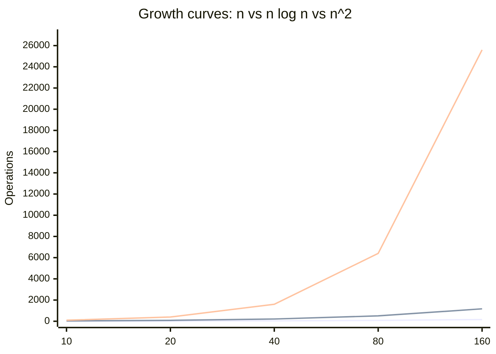

# O(n log n) — Linearithmic Time

## 1. Mathematical definition

Linearithmic growth sits between linear (`03-On-linear`) and quadratic
(`05-On2-quadratic`): cost grows like `n · log(n)`. Doubling `n` roughly doubles the
cost *plus a bit* (that extra `log n` factor), which is a world away from quadratic
growth, where doubling `n` quadruples the cost. See `concept.md` §1 for why we drop
constants and lower-order terms to get to this simplified form in the first place.

This is also where the Big O / Θ / Ω distinction from `concept.md` §2 gets genuinely
interesting, because comparison-based sorting has a **proven floor**. A comparison sort
decides the final order using only pairwise comparisons ("is `a[i] < a[j]`?"). There are
`n!` possible orderings of `n` items, and each comparison gives you at most one bit of
information (yes/no), so you need at least `log₂(n!)` comparisons to distinguish all of
them. By Stirling's approximation, `log₂(n!) ≈ n log n`. That means **no** comparison
sort can ever beat `Ω(n log n)` in the worst case — it's not an engineering limitation,
it's a counting argument. Merge sort *achieves* this floor exactly, which is why its
bound is written as `Θ(n log n)`, not just `O(n log n)`: it's the tight bound, upper and
lower at once.

Now apply best/average/worst case (`concept.md` §2) to this folder's canonical
algorithm, **merge sort**:

| Case | Bound | Why |
|---|---|---|
| Best case | Θ(n log n) | Always splits exactly in half and always merges — doesn't matter if input is already sorted |
| Average case | Θ(n log n) | Same splitting/merging structure regardless of data values |
| Worst case | Θ(n log n) | **Still the same** — no input shape makes it worse |

That worst-case row is the entire reason merge sort exists as a named strategy rather
than a footnote: **there is no adversarial input shape for it.** Its recursion always
splits the array exactly in half (by index, not by value), and merging two sorted halves
is always a linear scan — neither step depends on whether the data arrives sorted,
reverse-sorted, all-duplicate, or random. Compare that to quicksort, whose *average* case
is also Θ(n log n) but whose *worst* case degrades to Θ(n²) when a poor pivot choice
repeatedly splits `n` elements into a group of 1 and a group of `n-1` (e.g. already-sorted
input against a naive "always pick the first element" pivot rule). Quicksort is usually
*faster in practice on average* despite that theoretical guarantee gap — better constants,
in-place, cache-friendlier — but the full story of *why* and *how badly* it degrades
belongs entirely to `05-On2-quadratic`, not here. The one-line takeaway for this folder:
merge sort trades a bit of average-case speed for a guarantee that never breaks.

## 2. Derivation walkthrough

Merge sort's cost is defined by a recurrence: solving a problem of size `n` means solving
two subproblems of size `n/2`, plus linear work to combine their results.

```
T(n) = 2 · T(n/2) + O(n)
```

Walk it with a recursion tree (same method as `concept.md` §3 — identify the basic
operation, count it, simplify):

- **Level 0**: 1 problem of size `n`. Merging its two halves back together costs `O(n)`.
- **Level 1**: 2 subproblems of size `n/2`. Each merge costs `O(n/2)`; two of them is
  `O(n)` total.
- **Level 2**: 4 subproblems of size `n/4`. Each merge costs `O(n/4)`; four of them is
  `O(n)` total.
- **Level k**: `2^k` subproblems of size `n / 2^k`. Total merge work at this level is
  still `O(n)` — the per-subproblem cost shrinks, but the subproblem count grows to
  match, and they cancel out.

So **every level of the tree does `O(n)` total work**, no matter how deep you are. The
only question left is: how many levels are there? The array halves each time you go
down a level, so you hit subproblems of size 1 after `log₂(n)` levels.

```
total work = (work per level) × (number of levels) = O(n) × O(log n) = O(n log n)
```

In code terms, the basic operation is an element comparison during a merge. Each of the
`log n` "passes" over the data does a full linear scan (`O(n)` comparisons) to merge
adjacent sorted runs — `log n` passes × `n` comparisons per pass = `n log n` comparisons
total. This is exactly the same shape as the recursion-tree argument, just viewed
bottom-up instead of top-down (which is also literally how an iterative/bottom-up merge
sort implementation works — see `algorithms.md`).

## 3. Visual graph



At `n = 160`, linear is 160 operations and quadratic is 25,600 — a 160x gap. Linearithmic
sits at 1,172: it tracks much closer to the `n` line than the `n²` line, and that gap only
widens as `n` grows further. `O(1)` and `O(log n)` (folders `01` and `02`) would sit as
near-flat lines at the very bottom of this chart — essentially invisible at this scale,
which is itself the point. The full 7-curve comparison lives in the root `capstone.md`.

## 4. Layman explanation

Picture a phone book — one giant, un-sorted stack of index cards, one name per card, and
you need it alphabetized.

**The linearithmic way (merge sort):** split the stack into two piles. Split each of
those into two more. Keep splitting until every pile has exactly one card (a single card
is trivially "sorted"). Now merge piles back together two at a time: take the top card
off each of the two small sorted piles, whichever comes first alphabetically goes down,
repeat until both piles are empty — that's a linear scan across however many cards are in
the two piles combined. Merge pairs of piles into bigger sorted piles, then merge *those*
pairs into bigger piles still, until you're back to one fully sorted stack. Every merge
"pass" touches every card exactly once (that's the `n`), and the piles only need to double
in size `log n` times before you're back to one pile (that's the `log n`).

**Contrast with the naive way (selection sort, O(n²)):** scan the *entire* remaining
stack to find the single smallest name, place it down, then scan the *entire* remaining
stack again for the next smallest, and so on. Doubling the size of the phone book doesn't
just double your work here — you're now scanning a stack that's twice as big, *twice as
many times*, so the work roughly quadruples. That's the difference a data engineer feels
directly: merge-sorting a file of 10 million rows costs a small multiple more than
sorting 5 million; naive-sorting 10 million costs *four times* what 5 million costs.
