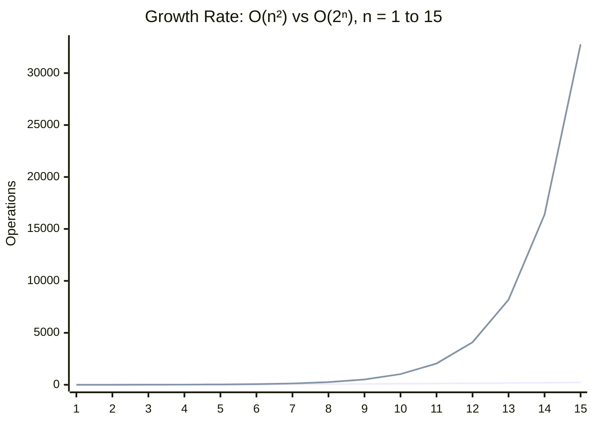

# O(2ⁿ) — Exponential Time

## Mathematical Definition

Exponential time means the cost roughly **multiplies by a constant factor every time n grows
by 1** — not "grows by a constant amount," *multiplies*. That's the whole story of why this
class feels different from everything before it in this path (01 through 05): O(n²) at least
lets you double n and only 4x the cost. Here, every single +1 to n doubles (or triples, or
1.618x's — the base varies) the cost on top of everything before it.

Formally, `f(n) = O(2ⁿ)` if there exist constants `c > 0` and `n₀` such that `f(n) ≤ c·2ⁿ` for
all `n ≥ n₀` (concept.md §1). The base doesn't have to literally be 2 — `3ⁿ`, `1.618ⁿ`, `1.5ⁿ`
are all still "exponential" in the colloquial sense, because they share the defining trait: a
constant base raised to the n-th power, not n raised to a constant power. `2ⁿ` just happens to
be the base people reach for when naming the whole class, the way "O(n²)" stands in for "some
polynomial with n as an exponent."

**Applying concept.md §2 (Big O vs Θ vs Ω) to the canonical algorithms:**

- **Naive recursive Fibonacci** has no data-dependent branching at all. The recursion tree's
  *shape* depends only on `n` — the actual numeric values being added never change which branch
  gets taken. That means, unlike quicksort (concept.md §2's example, which is Θ(n log n)
  average but degrades to Θ(n²) on adversarial/sorted input), naive Fibonacci has **no
  adversarial input shape to worry about**. Best case = average case = worst case, always,
  because there's only one case. The precise tight bound is `Θ(φⁿ)` where
  `φ = (1+√5)/2 ≈ 1.618` (the golden ratio — derived below). Calling it "O(2ⁿ)" is a real,
  valid, and much easier-to-say *upper* bound, but the exact tight bound is a smaller
  exponential base. This is the flip side of concept.md §2's "when someone says O(n) they
  usually mean Θ(n)" observation: here, the commonly-used label (`O(2ⁿ)`) is deliberately loose
  because the exact base (`φⁿ`) is unwieldy to say out loud in conversation.
- **Power set / subset generation** for a set of n elements always produces exactly `2ⁿ`
  subsets — every element is independently either "in" or "out," so it's `2 × 2 × ... × 2` (n
  times), full stop. No input shape changes that count. So this one really is `Θ(2ⁿ)` exactly,
  in all three cases, not just an upper bound.
- The uncomfortable takeaway for this whole class: **you usually can't get lucky.** Quadratic
  algorithms (05) can have a friendly best case; exponential recursion without pruning
  typically has no "friendly" input at all — the blow-up is structural, baked into the
  recursion's shape, not something a nicer input dodges. (Algorithms *with* pruning — like
  branch-and-bound search — are the exception, and are called out in `algorithms.md`.)

## Derivation Walkthrough

**Naive recursive Fibonacci:**

```python
def fib(n):
    if n <= 1:
        return n
    return fib(n - 1) + fib(n - 2)
```

Following concept.md §3's method — identify the basic operation, count it as a function of n,
simplify:

1. Basic operation: one call to `fib`.
2. Let `T(n)` = number of calls made while computing `fib(n)`. Every call to `fib(n)` (for
   `n > 1`) makes exactly two further calls, so:
   `T(n) = T(n-1) + T(n-2) + 1`
   — the same recurrence as Fibonacci itself, just counting calls instead of values.
3. Solve it. The characteristic equation for `T(n) = T(n-1) + T(n-2)` is `x² = x + 1`, whose
   positive root is `φ = (1+√5)/2 ≈ 1.618`. So `T(n) = Θ(φⁿ)` — the *tight* bound.
4. The napkin-method *loose* bound (concept.md §1): pretend both recursive calls cost as much
   as the more expensive one, `T(n-1)`. Then `T(n) ≤ 2·T(n-1) + 1`, which solves to `T(n) =
   O(2ⁿ)`. This is where the class gets its name — it's a clean, easy upper bound, even though
   the real growth rate (`φⁿ ≈ 1.618ⁿ`) is smaller.

Drawing the tree for `fib(5)` makes the redundancy visible: `fib(3)` gets computed twice,
`fib(2)` three times, `fib(1)` five times. Nothing is cached, so every one of those repeats
re-triggers its *own* full sub-tree of calls below it. That redundant re-computation — not
"large n," not "adversarial input" — is the entire source of the exponential blow-up.

**Power set (recursive include/exclude):**

```python
def subsets(elements):
    if not elements:
        return [[]]
    first, rest = elements[0], elements[1:]
    without_first = subsets(rest)
    with_first = [[first] + s for s in without_first]
    return without_first + with_first
```

1. Basic operation: one recursive call per decision point (include element, or don't).
2. Recurrence: `T(n) = 2·T(n-1) + O(1)` call overhead per level.
3. Solve: `T(n) = Θ(2ⁿ)` — exactly, this time, matching the direct combinatorial count of `2ⁿ`
   subsets for n elements. There's no looser-vs-tighter gap here the way there is for
   Fibonacci, because the recurrence really is a clean doubling at every level (both branches
   cost the same — unlike Fibonacci's `T(n-1) + T(n-2)`, which is *lopsided*, and that
   asymmetry is exactly why Fibonacci's tight base (φ ≈ 1.618) comes out smaller than 2).

## Visual Graph

Growth curve for O(2ⁿ) against its neighbor one class down, O(n²) (05-On2-quadratic):



Notice how flat O(n²) looks by the right edge of that chart — at n=15 it's 225 vs. 32,768.
That's the whole point: quadratic, which felt "expensive" in the O(n²) folder, is basically a
flat line once exponential joins the picture.

Now the sneak peek at what's *next* (07-Onfactorial-factorial) — same idea, one class up, and
it happens even faster:

```
n     2ⁿ            n!
--    -----------   -----------
5     32            120
10    1,024         3,628,800
15    32,768        1,307,674,368,000
20    1,048,576     2,432,902,008,176,640,000
```

By n=20, `2ⁿ` (about a million) looks like a rounding error next to `n!` (2.4 quintillion).
Exponential is the point where "this is going to be slow" turns into "this will never finish"
— and factorial is the point after that, where even *that* stops being an exaggeration.

## Layman Explanation

Picture a text file where each line is a feature flag: `line 1: dark_mode`, `line 2:
beta_search`, `line 3: new_checkout`, and so on for n lines. You've been asked: "test every
possible combination of these flags on/off before we ship." With 1 flag, that's 2 configs to
test (on, off). With 2 flags, 4 configs. With 3 flags, 8. By the time someone's added a 20th
flag to that file, you're not looking at "20 more test runs" — you're looking at **over a
million** configs, because every single flag you add doubles the whole test matrix, not adds
to it. That's the power-set side of this class: reading one more line doesn't cost you a
little more work, it costs you *twice* the work you already had.

Naive Fibonacci is the same trap wearing a different disguise: it's a "note-taking" problem.
Imagine you're asked to compute line 30 of a file where each line's value is defined as "the
sum of the two lines before it" — but you're not allowed to write anything down. To get line
30 you re-derive line 29 and line 28 completely from scratch. To get line 29, you re-derive
line 28 (again!) and line 27, completely from scratch. Every single lookup re-triggers the
*entire* chain behind it, all the way back to line 1, over and over. You have all the
information you need the second time you need line 28 — you already computed it one step
ago — but with no notes, you're forced to redo it. That's exactly what naive recursive
Fibonacci does, and it's exactly what memoization (see `space-complexity.md`) fixes: keep
notes, and every line only ever gets computed once.
